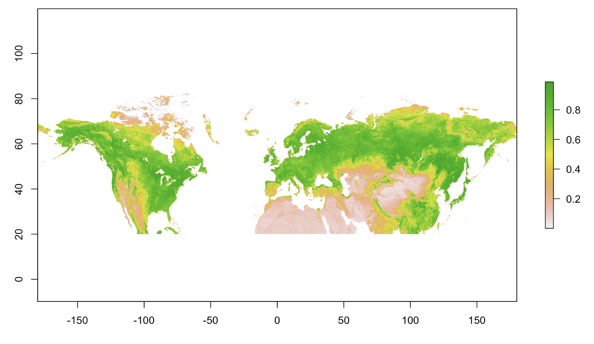

# How to open and work with NetCDF data in R

*Author: Alison Boyer*  
*Date: March 26, 2018*  
*Contact for ORNL DAAC: uso@daac.ornl.gov*  

### Keywords: R, netCDF

## Overview

In this tutorial we will open some geospatial data that is stored in a netCDF file. We will select the variable and time range of interest, and we will export the data to a GeoTIFF so that we can continue the analysis in R or other geospatial software.

## Source Data

Guay, K.C., P.S.A. Beck, and S.J. Goetz. 2015. Long-Term Arctic Growing Season NDVI Trends from GIMMS 3g, 1982-2012. ORNL DAAC, Oak Ridge, Tennessee, USA. <a href="https://doi.org/10.3334/ORNLDAAC/1275">https://doi.org/10.3334/ORNLDAAC/1275</a>

Specifically, we will use the file “gimms3g_ndvi_1982-2012.nc4”" from this dataset. 

## Prerequisites

R v3.4 or later. Required packages: 
<ul><li>ncdf4 -- for netcdf manipulation</li>
<li>raster -- for raster manipulation</li>
<li>rgdal -- for geospatial analysis</li>
<li>ggplot2 -- for plotting</li></ul>

## Procedure

Access the tutorial here:
[Tutorial](Read_NetCDF_tutorial_v3.Rmd)
