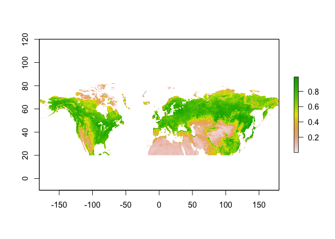
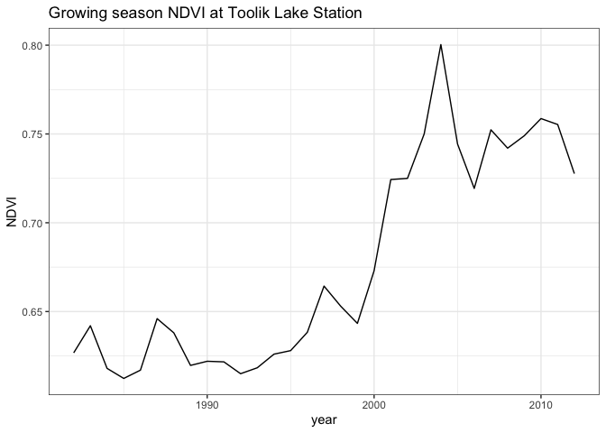
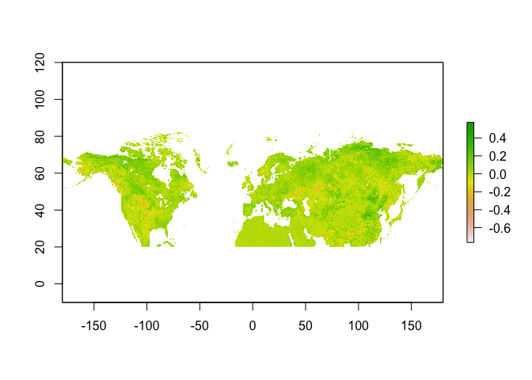

***

<!--------------------------- LOAD THIS FILE INTO RSTUDIO --------------------------->

# Install and Load Packages

In addition to the built-in functionality of R, we will use four packages throughout this exercise. Packages are a collection of documentation, functions, and other items that someone has created and compiled for others to use in R. Install the packages, as well as their dependencies, using the function `install.packages()`.


```r
install.packages("ggplot2", dependencies = TRUE) 
install.packages("ncdf4", dependencies = TRUE) 
install.packages("raster", dependencies = TRUE) 
install.packages("rgdal", dependencies = TRUE) 
```

Reading data stored in netCDF files is quite straightforward in R, provided that you load the appropriate packages. After installing the packages, their libraries need to be loaded to use the functions.


```r
library(ggplot2) 
library(ncdf4) 
library(raster) 
library(rgdal) 
```

For package details try `help()` (e.g., `help("raster")`), and to view the necessary arguments of a function try `args()` (e.g., `args(cover)`).

# Load Data

First, we need some data to manipulate. As an example, we will use data on trends in vegetation greenness in the Arctic created by Guay et al. (2015) titled "Long-Term Arctic Growing Season NDVI Trends from GIMMS 3g, 1982-2012." Specifically, we will use the file "gimms3g_ndvi_1982-2012.nc4."

This dataset provides normalized difference vegetation index (NDVI) data for the Arctic growing season derived primarily with data from Advanced Very High Resolution Radiometer (AVHRR) sensors on board several NOAA satellites over the years 1982 through 2012. The NDVI data, which show vegetation activity, were averaged annually for the arctic growing season (June, July, and August) in each year. The data are circumpolar in coverage at 8-kilometer resolution and limited to greater than 20 degrees North.

# Read the NetCDF File Contents

Use the `nc_open` function to read the data into a data structure named *nc_data*. Print the metadata about the file to a text file.


```r
nc_data <- nc_open("gimms3g_ndvi_1982-2012.nc4")
print(nc_data)
```

```
## File gimms3g_ndvi_1982-2012.nc4 (NC_FORMAT_NETCDF4_CLASSIC):
## 
##      2 variables (excluding dimension variables):
##         double time_bnds[nv,time]   (Chunking: [2,1])  (Compression: level 4)
##             calendar: standard
##             units: months since 1982-01-01 00:00:00
##         double NDVI[lon,lat,time]   (Chunking: [720,120,1])  (Compression: level 4)
##             grid_mapping: crs
##             standard_name: normalized_difference_vegetation_index
##             long_name: Mean Normalized Difference Vegetation Index in growing season (June, July, and August)
##             cell_methods: area: mean time: mean
##             _FillValue: -9999
##             missing_value: -9999
## 
##      4 dimensions:
##         time  Size:31   *** is unlimited *** 
##             calendar: standard
##             standard_name: time
##             units: months since 1982-01-01 00:00:00
##             bounds: time_bnds
##         nv  Size:2 (no dimvar)
##         lat  Size:840 
##             standard_name: latitude
##             long_name: latitude
##             units: degrees_north
##         lon  Size:4320 
##             standard_name: longitude
##             long_name: longitude
##             units: degrees_east
## 
##     10 global attributes:
##         GDAL_AREA_OR_POINT: Area
##         GDAL: GDAL 1.10.0, released 2013/04/24
##         Conventions: CF-1.6
##         title: Mean Normalized Difference Vegetation Index in growing season (June, July, and August)
##         source: GIMMGS3g
##         contact: Kevin Guay
##         institution: Woods Hole Research Center
##         email: kguay@whrc.org
##         references: Guay, K.C., P.S.A. Beck, L.T. Berner, S.J. Goetz, A. Baccini, and W. Buermann. 2014. Vegetation productivity patterns at high northern latitudes: a multi-sensor satellite data assessment. Global Change Biology 20(10):3147-3158. doi:10.1111/gcb.12647
##         history: Converted to CF-netCDF v4 at Oak Ridge National Laboratory Distributed Active Archive Center (ORNL DAAC) on Feb. 10th, 2015
```

From this output we see that there are two variables: "time_bnds", which contains the start and end date of each observation, and "NDVI", which is the variable of interest. "NDVI" has three dimensions written as [lon,lat,time].

There are a total of four dimensions in the file: "lat", "lon", "time", and "nv". The latter is used to record the beginning and end of the time range. In our case, we can ignore "nv" and focus on the three dimensions that are used to organize the NDVI data. There are also 10 global attributes which provide metadata information about the file.

We need to capture these data in these dimensions.  The following reads the latitudes, longitudes, and time of each NDVI observation and saves them to memory.


```r
lon <- ncvar_get(nc_data, "lon", verbose = FALSE)
head(lon)  # print the first few entries in the longitude vector
```

```
## [1] -179.9583 -179.8750 -179.7917 -179.7083 -179.6250 -179.5417
```

```r
lat <- ncvar_get(nc_data, "lat", verbose = FALSE)
t <- ncvar_get(nc_data, "time", verbose = FALSE)
```

Next, read in the data from the variable "NDVI" and verify the dimensions of the array.


```r
ndvi.array <- ncvar_get(nc_data, "NDVI")  # store the data in a 3-dimensional array
dim(ndvi.array)  # print the dimensions to the screen
```

```
## [1] 4320  840   31
```

Good. There are 4,320 longitude, 840 latitude, and 31 time values.

Another pertinent piece of information about the "NDVI" variable is the value used to designate missing data.


```r
fillvalue <- ncatt_get(nc_data, "NDVI", "_FillValue")
print(fillvalue)
```

```
## $hasatt
## [1] TRUE
## 
## $value
## [1] -9999
```

The fill value is -9999.

We can close the netCDF file now that the data have been read into an object. 


```r
nc_close(nc_data) 
```

# Working with the Data

Now we have the entire array of NDVI values for 4320 x 840 grid cells over each of 31 years. What can we do with it?

First, a little housekeeping. Replace all those pesky fill values with the R-standard "NA".


```r
ndvi.array[ndvi.array == fillvalue$value] <- NA
```

Let's get one year of the NDVI data and plot it.

Time is the third dimension of the *ndvi.array*. The first time slice represents the growing season of 1982. Just to make sure everything is working correctly, we can take a look at the dimensions of this time slice.


```r
ndvi.slice <- ndvi.array[, , 1]
dim(ndvi.slice)
```

```
## [1] 4320  840
```

The dimensions should be 4320 longitudes by 840 latitudes.

Everything checks out, so we can save the data as a raster. Note that we provide the coordinate reference system (CRS) in the standard well-known text format. For this dataset, it is the common "WGS 84" system (EPSG:4326).


```r
r <- raster(t(ndvi.slice),
            xmn = min(lon),
            xmx = max(lon),
            ymn = min(lat),
            ymx = max(lat),
            crs = CRS("+proj=longlat +ellps=WGS84 +datum=WGS84 +no_defs+ towgs84=0,0,0"))
```

We need to transpose and flip to orient the data correctly. The best way to figure this out is through trial and error, but remember that most netCDF files record spatial data beginning at the bottom left corner.


```r
r <- flip(r, direction = "y")
```

# Plotting

Finally, we can plot the raster to take a look at NDVI for 1982. Remember that these data are cut-off below 20 degrees North.


```r
plot(r)
```

<!-- -->

# Save as a GeoTIFF File

Let's save the raster as a GeoTIFF file.


```r
writeRaster(r, "GIMMS3g_1982.tif", "GTiff", overwrite = TRUE)
```

# Extract Data at a Study Site

Maybe you want a timeseries of NDVI at a study location, such as the Toolik Lake Field Station in Alaska (Latitude: 68.6275, Longitude: -149.5975).

First, convert the entire 3D array of data to a raster brick.


```r
# this step may take several minutes
r_brick <- brick(ndvi.array,
                 xmn = min(lat),
                 xmx = max(lat),
                 ymn = min(lon),
                 ymx = max(lon),
                 crs = CRS("+proj=longlat +ellps=WGS84 +datum=WGS84 +no_defs+ towgs84=0,0,0"))

# you might have manipulate using the transpose and/or flip functions before the data are oriented correctly. In this example, the netCDF file recorded latitude on the X and longitude on the Y, so both a transpose and a flip in the Y direction were required.
r_brick <- flip(t(r_brick), direction = "y")
```

Extract a timeseries of data at the Toolik Lake study location from the raster brick using the `extract()` function.


```r
toolik_lon <- -149.5975
toolik_lat <- 68.6275
toolik_series <- extract(r_brick, SpatialPoints(cbind(toolik_lon, toolik_lat)), method = "simple")
```

This timeseries is stored as a simple vector indexed only by the raster layer ID, so let's put it in an easier-to-use dataframe form and then plot the timeseries.


```r
toolik_df <- data.frame(year = seq(from = 1982, to = 2012, by = 1), NDVI = t(toolik_series))

ggplot(data = toolik_df, aes(x = year, y = NDVI, group = 1)) +
  geom_line() +  # make this a line plot
  ggtitle("Growing season NDVI at Toolik Lake Station") + 
  theme_bw()  # use the black and white theme
```

<!-- -->

Wow! The Toolik Lake site really is getting greener over time.

# Difference in NDVI Between Time Periods

The authors of this dataset identified long-term trends in NDVI over the 31 year period from 1982 to 2012. Their paper in Global Change Biology found some interesting patterns. Read more about it in:
Guay, K. C., Beck, P. S. A., Berner, L. T., Goetz, S. J., Baccini, A. and Buermann, W. (2014), Vegetation productivity patterns at high northern latitudes: a multi-sensor satellite data assessment. Glob Change Biol, 20: 3147-3158. https://doi.org/10.1111/gcb.12647

Let's look at the difference in NDVI between 1982 and 2012.

The *ndvi.slice* array has the data from 1982. Let's get the data from 2012, the 31st time slice.


```r
ndvi.slice.2012 <- ndvi.array[, , 31]
```

Now take the difference between them and save the difference as a raster.


```r
ndvi.diff <- ndvi.slice.2012 - ndvi.slice

r_diff <- raster(t(ndvi.diff),
                 xmn = min(lon),
                 xmx = max(lon),
                 ymn = min(lat),
                 ymx = max(lat),
                 crs = CRS("+proj=longlat +ellps=WGS84 +datum=WGS84 +no_defs+ towgs84=0,0,0"))
```

Re-orient the data and plot.


```r
r_diff <- flip(r_diff, direction = "y")

plot(r_diff)
```

<!-- -->

The areas that were greener in 2012 compared to 1982 are represented by positive numbers (green in this color scheme). Note that this is not a proper timeseries analysis like the authors did in their paper, it is showing only the difference between two particular years.

Congratulations, now you know how to open and read data from a netCDF file using R!
